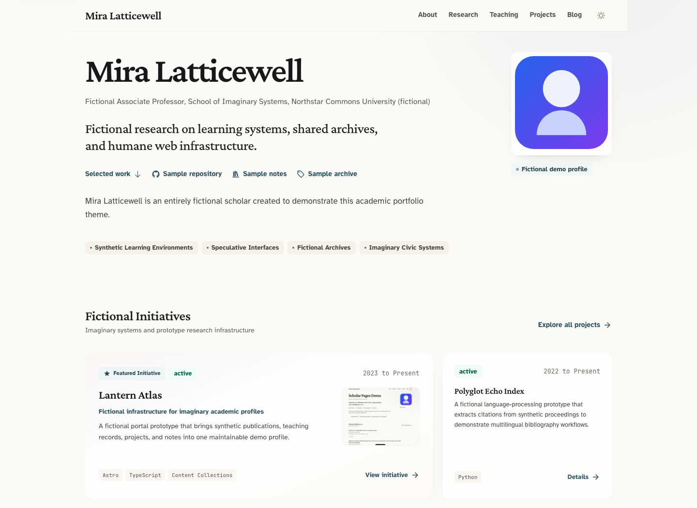
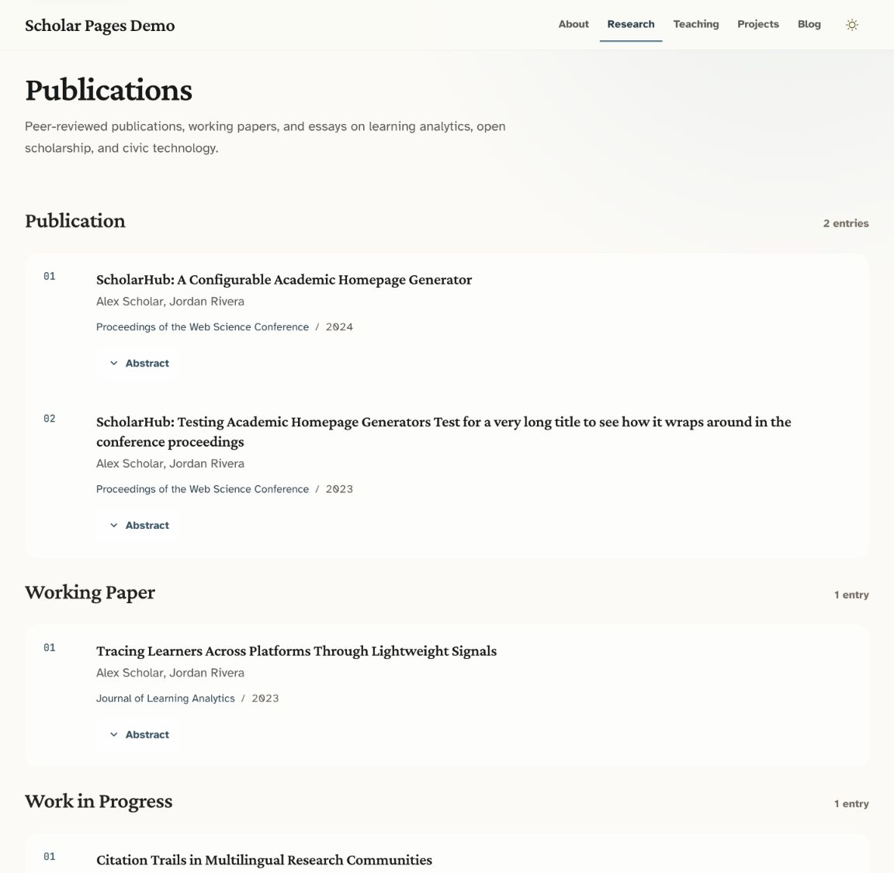

[English](./README.md) · [简体中文](./README.zh-CN.md)

# Scholar Pages

Scholar Pages 是一个用 Astro 构建的学术主页模板，适合展示个人简介、研究成果、项目、
教学和博客。页面样式已经配好，平时更新资料和文章基本不需要改动前端组件。

站点配置与具体内容分开存放：全站信息集中在一个 TypeScript 配置文件中，论文使用
BibTeX，个人经历使用 YAML，项目、课程和文章使用 Markdown。仓库中的 Mira Latticewell
以及相关经历都是虚构的，仅供演示。



## 模板包含什么

- 个人资料、任职经历、论文、项目、教学、学术服务、奖项和研究随笔等常用页面。
- 论文可以按类型筛选，也可以直接展开摘要；Cite 弹窗支持复制 BibTeX、APA 7、
  Chicago 和 Harvard 四种引用格式。
- 博客没有沿用项目页的网格，而是单独设计了编辑式版面；可以设置精选文章和封面，阅读
  时长会自动计算。
- 首页区块可以在 `site.config.ts` 中开关，包括个人介绍、精选项目、精选论文和近期文章。
- 桌面端和移动端都支持浅色与深色模式。键盘操作时能看到焦点位置，控件也保留了原生的
  无障碍支持。
- 模板内置 canonical URL、Open Graph、JSON-LD、站点地图和 `robots.txt`，也提供
  版本化的模板更新流程。

## 更多预览

### 博客页


### 论文页：摘要与引用



## 快速开始

### 环境要求

- [Node.js](https://nodejs.org/) 22.13 或更高版本
- [pnpm](https://pnpm.io/) 11 或更高版本

### 从模板创建站点

可以点击仓库中的
[**Use this template**](https://github.com/jxpeng98/astro-theme-scholars/generate)，
也可以在终端中运行：

```bash
pnpm create astro@latest my-scholar-site --template jxpeng98/astro-theme-scholars
cd my-scholar-site
pnpm dev
```

启动后，打开 [http://localhost:4321](http://localhost:4321) 查看网站。

### 本地开发模板

```bash
git clone https://github.com/jxpeng98/astro-theme-scholars.git
cd astro-theme-scholars
pnpm install
pnpm dev
```

仓库里的姓名、院校、论文、项目、课程和文章都是虚构示例。正式发布前，可以按下面的
顺序替换：

1. 先在 `site.config.ts` 中修改 `author`、`siteUrl` 和 `hero`。
2. 用自己的头像替换 `public/profile.svg`，或修改 `hero.profileImage`。
3. 把论文写入 `src/data/publications.bib`。
4. 在 `src/data/about.yml` 中填写个人经历。
5. 替换 `src/content/` 下的项目、教学和文章。
6. 换掉 `src/assets/` 中对应的封面图；不需要图片时，删除内容里的图片字段即可。

准备部署时，请先运行 `pnpm verify`。

## 内容改哪里

| 内容 | 文件 |
| --- | --- |
| 姓名、个人资料、单位、链接、SEO 和页面简介 | `site.config.ts` |
| 已发表论文与工作论文 | `src/data/publications.bib` |
| 简介、工作经历、教育经历、学术服务和奖项 | `src/data/about.yml` |
| 研究与软件项目 | `src/content/projects/*.md` |
| 当前和过往教学经历 | `src/content/teaching/*.md` |
| 博客与研究随笔 | `src/content/posts/*.{md,mdx}` |
| 头像、favicon 和其他静态文件 | `public/` |
| 项目、教学和文章封面 | `src/assets/` |
| 颜色、字体、图标和共用样式变量 | `uno.config.ts` |

## 站点配置

`site.config.ts` 管理全站共用的信息。通常只需要填写身份资料和想要自定义的选项；
`defineSiteConfig` 会为没有填写的导航、页面标题、页脚文案、图片尺寸和首页区块标题
提供默认值。

```ts
import { defineSiteConfig } from "./src/config/site";

export const siteConfig = defineSiteConfig({
  author: "你的姓名",
  siteUrl: "https://your-site.example",
  hero: {
    headline: "用一句简洁的话概括你的研究方向。",
    subheadline: "用一小段文字介绍你的工作与学术兴趣。",
    profileImage: "/profile.jpg",
    statusBadge: "欢迎合作",
  },
  affiliations: [
    {
      role: "助理教授",
      department: "信息学院",
      institution: "某某大学",
      url: "https://example.edu",
    },
  ],
  researchInterests: [
    "学习分析",
    "人机交互",
  ],
  socialLinks: [
    {
      label: "Google Scholar",
      href: "https://scholar.google.com/...",
      icon: "i-academicons:google-scholar",
    },
    {
      label: "GitHub",
      href: "https://github.com/your-handle",
      icon: "i-mdi:github",
    },
  ],
  homeBlocks: {
    hero: { enabled: true },
    showcase: {
      enabled: true,
      title: "精选项目",
    },
    publications: { enabled: true },
    posts: { enabled: true },
  },
});

export default siteConfig;
```

部署前请把 `siteUrl` 改成正式站点地址。canonical URL、Open Graph URL、
`robots.txt` 和站点地图都会使用这个值。

## 内容管理

### 论文

论文统一写在 `src/data/publications.bib` 中。除标准 BibTeX 字段外，模板还会读取
`public`，并据此决定论文在 Research（论文）页面中的分组。

```bibtex
@inproceedings{latticewell2026signalatlas,
  title = {Signal Atlas for an Imaginary Archive},
  author = {Latticewell, Mira},
  booktitle = {Proceedings of the Fictional Systems Forum},
  year = {2026},
  url = {https://example.com/signal-atlas},
  abstract = {A fictional paper used to demonstrate citation metadata.},
  public = {yes},
  keywords = {fictional archives, demo data}
}
```

| `public` 值 | 页面分组 |
| --- | --- |
| `yes` | Publication（已发表） |
| `wp` | Working Paper（工作论文） |
| `wip` | Work in Progress（进行中） |
| 其他值或未填写 | Other（其他） |

首页的精选论文只会从 `public = {yes}` 的记录中选取。论文带有 `abstract` 时，摘要可以
直接在列表中展开；点击 Cite 会打开引用弹窗，其中提供 BibTeX、APA 7、Chicago 和
Harvard 四种格式。填写 `url` 后，标题会链接到对应地址，卡片上也会出现一个紧凑的
PDF 按钮。

### 关于

About 页的个人信息、工作经历、教育经历和学术服务都在 `src/data/about.yml` 中，奖项、
演讲等内容也可以放进自定义区块。文件里的顺序就是页面上的顺序。不需要某个区块时，
删除对应的顶层列表或将其设为 `[]`；空的可选记录不会渲染。

页面标题和简介仍在 `site.config.ts` 中修改。宽屏布局下，第一个自定义区块会与
Academic Service 并排显示。

### 项目与教学

项目和课程各自使用一个带 YAML frontmatter 的 Markdown 文件，分别放在
`src/content/projects/` 和 `src/content/teaching/` 中。构建时会检查字段是否有效，文件名
会成为详情页 URL 的一部分。外部资源写在 `links` 字段中。所有可用字段、图片写法、
站内链接和旧版 YAML 的迁移方法，见[内容编写指南](./docs/content-authoring.md)。

### 文章

在 `src/content/posts/` 中创建 Markdown 或 MDX 文件：

```yaml
---
title: "文章标题"
description: "简短摘要。"
publishedAt: 2026-01-15
updatedAt: 2026-02-03
featured: true
heroImage: ../../assets/posts/post-cover.jpg
heroImageAlt: "准确描述封面内容"
tags:
  - 研究方法
  - 开放科学
draft: false
---
```

`draft: true` 的文章不会出现在生成的网站中。博客页会把最新一篇标记为
`featured: true` 的已发布文章放在主推位置；如果没有精选文章，就使用最新发布的一篇。
阅读时长根据 Markdown 正文自动计算。设置 `heroImage` 时，必须同时填写
`heroImageAlt`。

## 内置页面

| 路径 | 用途 |
| --- | --- |
| `/` | 个人资料、精选项目、精选论文和近期文章 |
| `/about` | 个人信息、经历、教育、学术服务与自定义区块 |
| `/researches` | 按研究状态分组、支持筛选的论文列表 |
| `/teaching` | 按学期整理的当前与过往教学记录 |
| `/teaching/[slug]` | 单门课程详情与外部资源 |
| `/projects` | 当前和过往项目，以及各自的元数据与链接 |
| `/projects/[slug]` | 单个项目详情与外部资源 |
| `/posts` | 精选文章与编辑式文章归档 |
| `/posts/[slug]` | 文章正文、阅读信息和分享链接 |

## 项目结构

```text
.
├── public/                    # 静态图片和图标
├── docs/screenshots/         # README 预览图
├── site.config.ts            # 站点主配置
├── src/
│   ├── assets/               # 交给 Astro 优化的项目、教学和文章图片
│   ├── components/           # 页面、卡片和筛选组件
│   ├── config/               # 配置默认值
│   ├── content/              # 项目、教学和文章内容条目
│   ├── data/                 # BibTeX 论文与 YAML 个人经历
│   ├── layouts/              # 共用页面布局
│   ├── lib/                  # 内容处理与 SEO 工具
│   └── pages/                # Astro 路由
├── astro.config.ts
├── uno.config.ts
└── package.json
```

## 常用命令

| 命令 | 说明 |
| --- | --- |
| `pnpm dev` | 启动开发服务器 |
| `pnpm build` | 将静态网站构建到 `dist/` |
| `pnpm preview` | 在本地预览生产构建 |
| `pnpm test` | 运行单元测试 |
| `pnpm astro check` | 运行 Astro 与 TypeScript 检查 |
| `pnpm verify` | 依次运行测试、检查、构建和生成结果断言 |

## 部署

`pnpm verify` 会运行测试和类型检查，并把静态网站构建到 `dist/`。部署前请运行一次：

```bash
pnpm verify
```

`dist/` 可以直接部署到 Cloudflare Pages、Vercel、Netlify、GitHub Pages 或其他静态
托管平台。如果由托管平台负责构建，请将构建命令设为 `pnpm build`，输出目录设为
`dist`。

## 模板更新

模板版本使用 SemVer 标签，例如 `v0.8.0`。通过 GitHub 模板创建的站点有自己的 Git
历史，因此不直接合并模板仓库。模板更新会以 PR 的形式提交，确认差异后再决定是否合并。

更新前先查看 `.template-version`。如果文件不存在，或其中的版本早于 `0.6.0`，请使用
后文的一次性迁移方法；即使仓库中已经有更新工作流，也需要这样处理。

`v0.6.x` 站点还要手动准备一次：先把 `v0.7.0` 中的
`.github/workflows/template-update.yml` 复制到默认分支。旧版更新器使用 GitHub 默认
令牌时无法替换工作流文件，所以这一步不能自动完成。操作一次即可；从 `v0.7.0` 开始，
更新器会运行目标版本自带的迁移逻辑，后续的数据迁移不用再次替换工作流。

### v0.6.0 或更新版本的站点

自动更新依赖以下三个文件：

- `.github/workflows/template-update.yml`
- `.template-sync.json`
- `.template-version`

更新步骤如下：

1. 打开 **Settings → Actions → General → Workflow permissions**，启用
   **Allow GitHub Actions to create and approve pull requests**。个人账户中新建的
   仓库默认禁用此权限，详情参见 GitHub 的
   [工作流权限文档](https://docs.github.com/en/repositories/managing-your-repositorys-settings-and-features/enabling-features-for-your-repository/managing-github-actions-settings-for-a-repository#preventing-github-actions-from-creating-or-approving-pull-requests)。
2. 打开 **Actions → Template Update → Run workflow**。同一工作流也会在每周一
   自动检查新版本。
3. 检查自动生成的 `chore/template-update-X.Y.Z` PR。更新器会先安装依赖并运行完整
   验证，再创建或更新 PR。PR 创建后，仍需确认代码差异适合自己的站点再合并。

不要在运行工作流前把 `.template-version` 改成目标版本，否则更新器会认为该版本已经
安装。

`.template-sync.json` 的 `protected` 列表用于标记不应被模板覆盖的路径。默认列表包括
站点配置、YAML 与 BibTeX 数据、内容条目、项目与教学图片、头像、favicon 和环境变量
文件。其余由模板维护的文件会更新到发布版本。如果改过模板代码，合并前尤其要仔细检查
整份 PR 的改动。

升级到 `v0.7.0` 时，更新器会先检查已停用的 `src/data/projects.yml` 和
`src/data/teaching.yml`。新版模板的演示条目不会混入站点；旧 YAML 中的个人记录会转换
成 Markdown 内容条目，原文件则保留下来，方便比较或回滚。已有的 Markdown 条目不会
被覆盖。确认新条目和详情页无误后，再删除旧 YAML 文件。

#### 更新工作流文件时推送被拒绝

仓库内置的 `GITHUB_TOKEN` 是 GitHub App 的安装令牌。要新增或修改
`.github/workflows` 下的文件，该令牌还必须有单独的 `Workflows` 权限；允许创建 PR
并不包含这项权限。

没有配置 `TEMPLATE_UPDATE_TOKEN` 时，更新器会自动跳过 `.github/workflows/**`，
其余模板文件仍可使用默认令牌更新。工作流相关的改动需要检查后手动应用。

如果希望更新器一并同步工作流文件，请创建一个仅限当前仓库的细粒度个人访问令牌（fine-grained personal access token），
并授予 `Contents: Read and write`、
`Pull requests: Read and write` 和 `Workflows: Write` 权限。然后将其保存为 Actions
secret `TEMPLATE_UPDATE_TOKEN`；不要把令牌本身写进工作流文件。更新器会自动检测该
secret。

如果站点安装的更新器早于 `v0.7.0`，请先完成上面的手动准备，再重新运行
**Template Update**。如果打算一直手动维护工作流，也可以把
`.github/workflows/**` 加入站点 `.template-sync.json` 的 `protected` 列表。

请为令牌设置有效期，并且只授权目标仓库；不用后及时撤销。组织仓库可能还需要管理员
批准。具体权限设置见 GitHub 的
[personal access token 权限文档](https://docs.github.com/en/authentication/keeping-your-account-and-data-secure/managing-your-personal-access-tokens)、
[Actions secrets 文档](https://docs.github.com/en/actions/how-tos/write-workflows/choose-what-workflows-do/use-secrets)，
以及 GitHub App 的
[`Workflows` 权限说明](https://docs.github.com/en/apps/creating-github-apps/registering-a-github-app/choosing-permissions-for-a-github-app#choosing-permissions-for-git-access)。

### 早于 v0.6.0 的站点

先确认工作区没有未提交的改动，然后在旧站点仓库根目录下使用兼容 Bash 的终端运行以下
迁移命令。脚本会把旧版个人配置迁移到 `site.config.ts`，补上兼容入口，并清理已废弃、
由模板维护的内容和 robots 文件；个人内容会保留下来。

```bash
git switch -c chore/template-update-v0.8.0

template_dir="$(mktemp -d)"
template_dir="$(cd "$template_dir" && pwd -P)"
git clone --depth 1 --branch v0.8.0 \
  https://github.com/jxpeng98/astro-theme-scholars.git \
  "$template_dir"

node "$template_dir/scripts/sync-template-release.mjs" \
  --source "$template_dir" \
  --target . \
  --config "$template_dir/.template-sync.json"

pnpm install --frozen-lockfile
node scripts/migrate-legacy-content.mjs
pnpm verify
git status --short
git diff
```

运行完成后，先检查迁移结果，再提交并创建 PR。迁移会同时安装自动更新文件，之后的版本
可以直接使用前面的工作流。如果脚本提示旧配置结构不受支持，请手动迁移定制配置，不要
强制同步。提交前，也要恢复默认保护范围之外的其他个人文件。

不要使用 `--allow-unrelated-histories` 直接合并模板仓库。GitHub 文档也说明了
[通过模板创建的仓库拥有独立的 Git 历史](https://docs.github.com/en/repositories/creating-and-managing-repositories/creating-a-template-repository#about-template-repositories)。

### 发布模板版本

维护模板时，使用以下命令检查并发布版本：

```bash
pnpm verify
node scripts/check-release.mjs --tag v0.8.0
git push origin main
git tag -a v0.8.0 -m "v0.8.0"
git push origin v0.8.0
```

发布前，确认 `package.json`、`.template-version` 和 `CHANGELOG.md` 最新条目中的
版本号一致。标签推送后，发布工作流会自动创建 GitHub Release。

## 参与贡献

欢迎提交 Issue 和 Pull Request。改动范围较大时，请先开一个 Issue，说明预期行为和
大致范围。

## 开源协议

本项目基于 [MIT License](./LICENSE) 发布。
